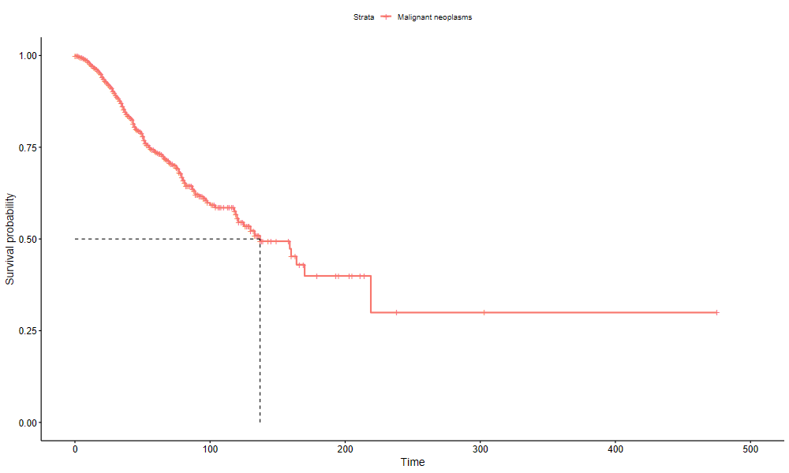

# Survival Analysis Visualization Project

## Overview
This project aims to visualize survival analysis results using the `ggsurvplot` function from the `survminer` package in R. Specifically, it focuses on plotting the survival curve for patients with malignant neoplasms.

## Data
The dataset used in this project is `malignant_neoplasms_deceased`, which contains survival information for individuals diagnosed with malignant neoplasms.
The dataset can be downloaded from the following website: [Download Dataset](https://www.fonasa.cl/sites/fonasa/datos-abiertos/bases-grd)

## Dependencies
To run the code in this project, you will need to install the following R packages:
- survival
- survminer

You can install these packages using the following commands:

```
install.packages("survival") 
install.packages("survminer")
```

## Usage
To generate the survival plot, you will need to have a survival object `fit` created using the `survfit` function from the `survival` package. With this object, you can then use the `ggsurvplot` function to create the plot.

Here is an example of how to create the plot:

```
library(survival) 
library(survminer)

fit <- survfit(Surv(time, status) ~ 1, data = malignant_neoplasms_deceased)

ggsurvplot(fit, data = malignant_neoplasms_deceased, surv.median.line = "hv")
```

The `surv.median.line = "hv"` argument adds a horizontal-vertical line to the median survival time on the plot.

## Output
The output is a plot that displays the survival curve for the dataset provided, with a line indicating the median survival time.




